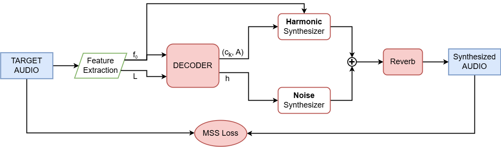

# Harmonic-plus-Noise

Harmonic-plus-Noise synthesis decomposes an audio signal into two complementary components: harmonic and noise. The harmonic component models periodic sounds as a sum of sinusoidal oscillators, while the noise component captures the non-periodic, broadband content.

A signal $x[n]$ is expressed as:

$
x[n] = \underbrace{\sum_{k=1}^N A_k[n] \sin\left(2\pi f_k[n] n T + \phi_k[n]\right)}_{\text{Harmonic Component}} + \underbrace{e[n]}_{\text{Noise Component}}
$

Where $T$ is the sampling period, $N$ is the number of harmonics, while $A_k[n]$, $f_k[n]$, and $\phi_k[n]$ are respectively the amplitude, frequency, and phase of the $k$-th harmonic.
The noise component $e[n]$ can be modeled using subtractive synthesis:

$
e[n] = \mathcal{F}\big(\mathcal{N}[n]; \Theta\big),
$

Where $\mathcal{N}[n]$ is an input noise (e.g., white noise or gaussian noise), $\mathcal{F}$ is a filter function, and $\Theta$ are the parameters of the filter (e.g. cutoff frequency).

## DDSP Implementation

The HpN architecture employs a decoder, formed of recurrent and fully connected layers, conditioned on a sequence of pitch ($f_0$) and loudness ($L$) frames to predict the overall amplitude of the audio signal ($A$), the normalized distribution of spectral variations among the various harmonics ($c_k$), and the coefficients of the filter used to model the noise component ($h$).

## Audio Examples

<table>
  <tr>
    <th></th>
    <th style="text-align: center;">Reference</th>
    <th style="text-align: center;">Anchor (LPC)</th>
  </tr>
  <tr>
    <td>🪈 Flute</td>
    <td>
      <audio controls>
        <source src="{{ site.baseurl }}/misc/audio/ref_anchor/flute_1_reference.wav" type="audio/mpeg">
        Your browser does not support the audio tag.
      </audio>
    </td>
    <td>
      <audio controls style="width: 150px; height: 30px;">
         <source src="{{ site.baseurl }}/misc/audio/ref_anchor/flute_1_anchor_p10_w800_srcimpulse.wav" type="audio/mpeg">
        Your browser does not support the audio tag.
      </audio>
    </td>
  </tr>
  <tr>
    <td>🎺 Trumpet</td>
    <td>
      <audio controls style="width: 150px; height: 30px;">
         <source src="{{ site.baseurl }}/misc/audio/ref_anchor/trumpet_1_reference.wav" type="audio/mpeg">
        Your browser does not support the audio tag.
      </audio>
    </td>
    <td>
      <audio controls style="width: 150px; height: 30px;">
         <source src="{{ site.baseurl }}/misc/audio/ref_anchor/trumpet_1_anchor_p10_w800_srcimpulse.wav" type="audio/mpeg">
        Your browser does not support the audio tag.
      </audio>
    </td>
  </tr>
  <tr>
    <td>🎻 Violin</td>
    <td>
      <audio controls style="width: 150px; height: 30px;">
         <source src="{{ site.baseurl }}/misc/audio/ref_anchor/violin_1_reference.wav" type="audio/mpeg">
        Your browser does not support the audio tag.
      </audio>
    </td>
    <td>
      <audio controls style="width: 150px; height: 30px;">
         <source src="{{ site.baseurl }}/misc/audio/ref_anchor/violin_1_anchor_p10_w800_srcimpulse.wav" type="audio/mpeg">
        Your browser does not support the audio tag.
      </audio>
    </td>
  </tr>
  <tr>
    <td>🎹 Piano</td>
    <td>
      <audio controls style="width: 150px; height: 30px;">
         <source src="{{ site.baseurl }}/misc/audio/ref_anchor/piano_1_reference.wav" type="audio/mpeg">
        Your browser does not support the audio tag.
      </audio>
    </td>
    <td>
      <audio controls style="width: 150px; height: 30px;">
         <source src="{{ site.baseurl }}/misc/audio/ref_anchor/piano_1_anchor_p10_w800_srcimpulse.wav" type="audio/mpeg">
        Your browser does not support the audio tag.
      </audio>
    </td>
  </tr>
</table>

### Harmonic-plus-Noise

<table>
  <tr>
    <th></th>
    <th style="text-align: center;">Full</th>
    <th style="text-align: center;">Reduced</th>
    <th style="text-align: center;">Reduced+AD</th>
    <th style="text-align: center;">Reduced+CD</th>
  </tr>
  <tr>
    <td>🪈 Flute</td>
    <td>
      <audio controls>
        <source src="{{ site.baseurl }}/misc/audio/hpn/flute_1_hpn_teacher.wav" type="audio/mpeg">
        Your browser does not support the audio tag.
      </audio>
    </td>
    <td>
      <audio controls>
        <source src="{{ site.baseurl }}/misc/audio/hpn/flute_1_hpn_student.wav" type="audio/mpeg">
        Your browser does not support the audio tag.
      </audio>
    </td>
    <td>
      <audio controls>
        <source src="{{ site.baseurl }}/misc/audio/hpn/flute_1_hpn_student_KD_audio.wav" type="audio/mpeg">
        Your browser does not support the audio tag.
      </audio>
    </td>
    <td>
      <audio controls>
        <source src="{{ site.baseurl }}/misc/audio/hpn/flute_1_hpn_student_KD_params.wav" type="audio/mpeg">
        Your browser does not support the audio tag.
      </audio>
    </td>
  </tr>
  <tr>
    <td>🎺 Trumpet</td>
    <td>
      <audio controls>
        <source src="{{ site.baseurl }}/misc/audio/hpn/trumpet_1_hpn_teacher.wav" type="audio/mpeg">
        Your browser does not support the audio tag.
      </audio>
    </td>
    <td>
      <audio controls>
        <source src="{{ site.baseurl }}/misc/audio/hpn/trumpet_1_hpn_student.wav" type="audio/mpeg">
        Your browser does not support the audio tag.
      </audio>
    </td>
    <td>
      <audio controls>
        <source src="{{ site.baseurl }}/misc/audio/hpn/trumpet_1_hpn_student_KD_audio.wav" type="audio/mpeg">
        Your browser does not support the audio tag.
      </audio>
    </td>
    <td>
      <audio controls>
        <source src="{{ site.baseurl }}/misc/audio/hpn/trumpet_1_hpn_student_KD_params.wav" type="audio/mpeg">
        Your browser does not support the audio tag.
      </audio>
    </td>
  </tr>
  <tr>
    <td>🎻 Violin</td>
    <td>
      <audio controls>
        <source src="{{ site.baseurl }}/misc/audio/hpn/violin_1_hpn_teacher.wav" type="audio/mpeg">
        Your browser does not support the audio tag.
      </audio>
    </td>
    <td>
      <audio controls>
        <source src="{{ site.baseurl }}/misc/audio/hpn/violin_1_hpn_student.wav" type="audio/mpeg">
        Your browser does not support the audio tag.
      </audio>
    </td>
    <td>
      <audio controls>
        <source src="{{ site.baseurl }}/misc/audio/hpn/violin_1_hpn_student_KD_audio.wav" type="audio/mpeg">
        Your browser does not support the audio tag.
      </audio>
    </td>
    <td>
      <audio controls>
        <source src="{{ site.baseurl }}/misc/audio/hpn/violin_1_hpn_student_KD_params.wav" type="audio/mpeg">
        Your browser does not support the audio tag.
      </audio>
    </td>
  </tr>
  <tr>
    <td>🎹 Piano</td>
    <td>
      <audio controls>
        <source src="{{ site.baseurl }}/misc/audio/hpn/piano_1_hpn_teacher.wav" type="audio/mpeg">
        Your browser does not support the audio tag.
      </audio>
    </td>
    <td>
      <audio controls>
        <source src="{{ site.baseurl }}/misc/audio/hpn/piano_1_hpn_student.wav" type="audio/mpeg">
        Your browser does not support the audio tag.
      </audio>
    </td>
    <td>
      <audio controls>
        <source src="{{ site.baseurl }}/misc/audio/hpn/piano_1_hpn_student_KD_audio.wav" type="audio/mpeg">
        Your browser does not support the audio tag.
      </audio>
    </td>
    <td>
      <audio controls>
        <source src="{{ site.baseurl }}/misc/audio/hpn/piano_1_hpn_student_KD_params.wav" type="audio/mpeg">
        Your browser does not support the audio tag.
      </audio>
    </td>
  </tr>
</table>